[linktree](https://linktr.ee/shreesh9) &nbsp;·&nbsp;
[instagram](https://www.instagram.com/shxeesh_/) &nbsp;·&nbsp;
[linkedin](https://www.linkedin.com/in/shreesh9/) &nbsp;·&nbsp;
[email](mailto:shreeshnalawade9@gmail.com)

> CSE (AI & ML) student at Mumbai University. 
> Small, sharp tools over big vague ideas.

I build fast, test on real users, and kill what doesn't work. Right now that's 
[koshi-career-agent](https://github.com/shreesh9/koshi-career-agent) — an AI career coach that turns skill gaps into 
roadmaps. Also deep into full-stack work: government portals, price-tracking 
agents, and cloud infra on AWS.

<samp>python &nbsp; javascript &nbsp; php &nbsp; java &nbsp; c++ &nbsp; react &nbsp; mysql &nbsp; aws &nbsp; git &nbsp; linux</samp>

**[koshi-career-agent](https://github.com/shreesh9/koshi-career-agent)** &nbsp;·&nbsp; <samp>javascript</samp> 
AI-powered career coach and skill navigator. Tailored learning roadmaps, 
skill-gap analysis, and interactive mentoring: profile in, plan out.

**[PRICE-SENSE-AI](https://github.com/shreesh9/PRICE-SENSE-AI)** &nbsp;·&nbsp; <samp>javascript, next.js, supabase</samp> 
Automated price-tracking platform across Amazon, Walmart, and Zara. AI web 
scraping, Postgres with scheduled jobs, email alerts on drops.

**VisionBridge** &nbsp;·&nbsp; <samp>flutter, on-device ai, webrtc</samp> 
Voice-first assistive mobile app for the visually impaired. Real-time vision 
AI, OCR, text-to-speech, and live WebRTC video assistance.

**GST Dept & ShivJayanti Utsav Samiti Portal** &nbsp;·&nbsp; <samp>php, javascript, mysql</samp> 
Bilingual, fully dynamic event-management portal for Mumbai's GST Department, 
inaugurated by senior officials — cut admin overhead 40%, printing costs 80%.

Every graphic here is generated, not embedded from anyone else's server. 
`ascii.svg` is a photo pushed through a character ramp; the stat graphics and 
these section headings are drawn by [a scheduled action](.github/workflows/stats.yml) 
straight from the GitHub GraphQL API, once a day, committing only what changed.

They animate with SMIL inside the SVG, because GitHub strips scripts from 
READMEs — and since nothing loads from a third party, nothing here can 
rate-limit or go dark. The headings are SVGs for the same reason: GitHub also 
strips CSS, so an image is the only way to put this page's own typeface on them.

The typeface is [JetBrains Mono](scripts/fonts), subset to just the characters 
each graphic draws and inlined as base64. That isn't only for looks: the 
portrait's grid assumes an advance width of exactly 0.600 em, and a viewer whose 
default monospace is narrower would otherwise see it squeezed.

Language totals cover public repositories only. `year.svg` uses the portrait's 
character ramp: `:` `+` `#` `@`, quiet to loud.
